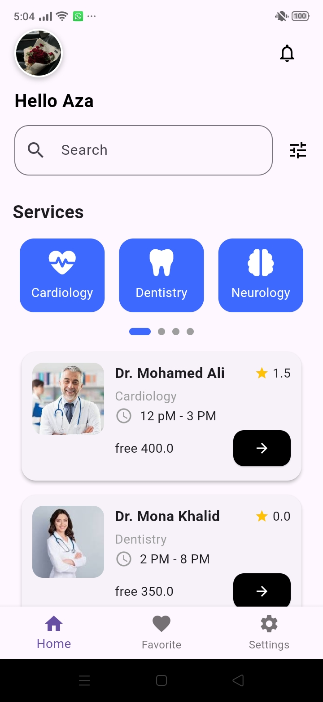
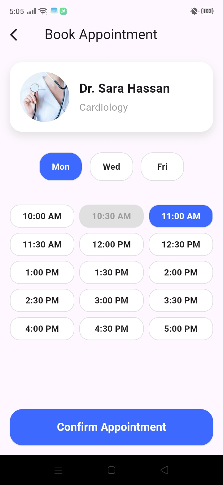

# 🩺 Medical Service App


---

<p align="center">
  
</p>

**Medical Service** is a modern mobile application built with Flutter that provides users with seamless medical service features — from booking appointments to checking health records and accessing medical info.


> This README is structured to help contributors, reviewers, and new developers quickly understand
> and run the project.

---

## 🔑 Highlights

- ✅ Doctor Appointment Booking  
- ✅ Secure Online Payments (Paymob)
- ✅ Real-Time Notifications
- ✅ Reviews & Ratings System
- ✅ Smart Search (Location + Specialties)
- ✅ User Profiles & Records  
- ✅ Clean & Intuitive UI (Flutter)  
- ✅ Secure & Scalable Architecture  


---

## 📸 Screenshots / Preview

> Replace these placeholders with real screenshots from `screenshots/` or `assets/`.

|               Home                     |              appointment                       |                Details               |
|:--------------------------------------:|:----------------------------------------------:|:------------------------------------:|
|        |  |  |

---

## 🏗️ Architecture Overview

```
lib/
├─ core/ # shared services, themes, constants
├─ features/
│ ├─ auth/
│ ├─ doctors/
│ ├─ appointments/
│ ├─ payments/
│ ├─ profile/
├─ widgets/ # reusable components
└─ main.dart
```

This layout helps keep features self-contained and easier to test.

---

## 🧩 Tech Stack

- Flutter
- supabase
- Bloc (flutter_bloc)
- GetIt (dependency injection)
- cached_network_image, image_picker
- OneSignal (notifications)
- Shared Preferences (local storage)
- Optional: CI (GitHub Actions) for build & test

---

## 🎯 Design & UX Decisions

- **Colors & Theming** — centralized in `ColorsManager` to support both Light & Dark themes. Colors chosen for clarity, calmness, and accessibility in a medical context.
- **Home & Appointment Layouts** — clean and minimalistic design to make navigation intuitive. Key actions (booking, viewing details) are easily accessible.
- **Doctor & Appointment Cards** — designed for readability and quick scanning. Includes profile picture, specialty, rating, and available slots.
- **Navigation** — bottom navigation bar with clear icons for Home, Appointments, Profile, and Payments.
- **Performance** — images cached using `cached_network_image`, lazy loading for lists, and stream-based updates to reduce UI thrash.
- **Responsiveness** — layouts adapt to different screen sizes and orientations (mobile & tablet).
- **Notifications & Alerts** — subtle animations and notifications for appointments, payments, and messages, enhancing user experience without being intrusive.
- **Accessibility** — high contrast colors, legible fonts, clear button sizes, and ARIA-friendly text for screen readers.

---

## 🚀 Getting Started (Developer)

### Prerequisites

- Flutter SDK (stable)
- Android Studio or VS Code

### Quick setup

```bash
# Clone
git clone https://github.com/AzaKhaled/Medical_Service.git
cd Medical_Service 

# Install
flutter pub get

# Run
flutter run
```


## 🧪 Testing

- Unit tests: `flutter test`
- Widget/integration tests: `flutter drive` / `integration_test`

Consider adding mocks for Firestore and Auth when writing unit tests.

---

## 📌 Pinned Chats & UX Notes

- Pinned chats should be stored as a boolean/priority in Firestore (`pinned: true` or
  `pinnedAt: timestamp`).
- Sort chats locally by `pinned` then `lastMessage.timestamp` to always surface pinned chats at top.

---

## 🛠️ Common commands

```bash
# Analyze
flutter analyze

# Format
flutter format .

# Run on device
flutter run

# Build
flutter build apk --release
```

---

## 📣 Contributing

1. Fork the repo
2. Create a feature branch
3. Open a PR with description & screenshots

Please follow the existing style and write tests for new logic.

---

## 📬 Contact

azakhaled813@gmail.com


---

*Generated and polished for clarity, structure and developer onboarding.*
